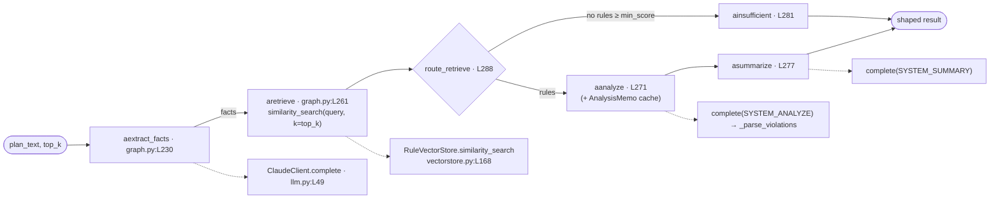
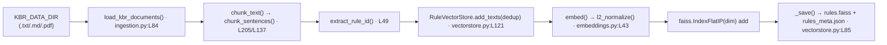
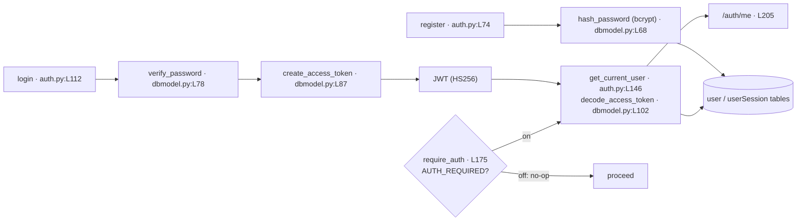

# ChattamAI — Developer Architecture Map

**Who this is for:** a developer who needs to know *which function does what and where it lives* before changing the app.

Every node label carries `file:line` so you can jump straight to the definition. Line numbers were extracted live from the source at commit **`b58ff7e`** (branch `feature/optimized-rag`). If the code drifts, re-derive rather than trust stale numbers.

**One rule that shapes everything:** `app/` module imports are **boot-safe and lazy** — heavy deps (`faiss`, `openai`, `anthropic`, `pypdf`, OCR libs) load only at construction/call time, never at import. That's why the app boots with zero credentials and why the offline test suite works. Preserve this invariant when extending.

---

## 1 · Full-system flowchart

Four subsystems. The **Check** subgraph is the product; **Boot** wires it; **Ingest** feeds it the Kerala Building Rules (KBR) index; **Auth** guards the mutating endpoints.

```mermaid
flowchart TD
    %% ============ BOOT ============
    subgraph BOOT["Boot — app/main.py"]
        A["uvicorn app.main:app"] --> B["lifespan() · L18"]
        B --> C["RAGSystem() eager build<br/>system.py:L121"]
        B --> D["init_db_safe()<br/>database_init.py:L24"]
        C --> E["app.state.rag = RAGSystem<br/>main.py:L22"]
        C --> F["Context dataclass<br/>graph.py:L44"]
        C --> G["build_compliance_graph()<br/>graph.py:L394"]
        C --> H["build_async_compliance_graph()<br/>graph.py:L415"]
    end

    %% ============ INGEST ============
    subgraph INGEST["Ingest — build FAISS index"]
        I["POST /api/ingest · rag.py:L67"] -- "require_auth · auth.py:L175" --> J["RAGSystem.ingest(rebuild)<br/>system.py:L214"]
        J --> K["load_kbr_documents(dir)<br/>ingestion.py:L84"]
        K --> |".txt / .md"| K1["Path.read_text"]
        K --> |".pdf"| K2["_read_pdf → pypdf · ingestion.py:L76"]
        J --> L["chunk_text()<br/>ingestion.py:L205"]
        L --> M["chunk_sentences() · L137"]
        M --> N["split_sentences() · L111<br/>_hard_split() · L124"]
        J --> O["extract_rule_id(chunk)<br/>ingestion.py:L49"]
        J --> P["RuleVectorStore.add_texts(dedup)<br/>vectorstore.py:L121"]
        P --> Q["_content_hash · vectorstore.py:L27"]
        P --> R["provider.embed() · embeddings.py:L63"]
        R --> S["l2_normalize() · embeddings.py:L43"]
        S --> T["faiss.IndexFlatIP.add · _save()<br/>vectorstore.py:L85"]
    end

    %% ============ CHECK ============
    subgraph CHECK["Compliance check — LangGraph"]
        U["POST /api/check · rag.py:L82<br/>POST /api/check/upload · rag.py:L93<br/>POST /api/check/plan-ocr · rag.py:L121"]
        U --> V["RAGSystem.check · system.py:L338<br/>check_plan_file · L382"]
        V --> W["acheck · system.py:L321<br/>await agraph.ainvoke"]
        W --> X["aextract_facts · graph.py:L230<br/>llm.complete(SYSTEM_EXTRACT)"]
        X --> Y["aretrieve · graph.py:L261<br/>RuleVectorStore.similarity_search · vectorstore.py:L168"]
        Y --> Z{{"route_retrieve · graph.py:L288<br/>rules above min_score?"}}
        Z -- "no" --> AA["ainsufficient · graph.py:L281"]
        Z -- "yes" --> AB["aanalyze · graph.py:L271"]
        AB --> AB0[["AnalysisMemo.get · system.py:L76<br/>cache hit?"]]
        AB0 -- "miss" --> AB1["prompts.build_analyze_user · L53<br/>format_rules_for_prompt · L57"]
        AB1 --> AB2["llm.complete(SYSTEM_ANALYZE)"]
        AB2 --> AB3["_parse_violations · graph.py:L371<br/>→ _extract_json · L304"]
        AB3 --> AB4{{"parse failed?"}}
        AB4 -- "yes" --> AB5["repair: llm.complete(SYSTEM_ANALYZE_REPAIR)"]
        AB4 -- "no" --> AB6["_memo_put · graph.py:L359"]
        AB5 --> AB6
        AB0 -- "hit" --> AB6
        AB6 --> AC["asummarize · graph.py:L277<br/>llm.complete(SYSTEM_SUMMARY)"]
        AA --> AD["_shape_result · system.py:L263<br/>_log_check · L294"]
        AC --> AD
        AD --> AE["ComplianceResponse · schemas.py:L61"]

        subgraph OCR["opt-in OCR — app/rag/ocr.py"]
            OA["ocr_available() · L64"] --> OB["image_to_text() · L79<br/>pdf_images_to_text() · L105"]
            OB --> OC["normalize_ocr_text() · L130"]
        end
        OC -. "temp .txt re-enters shared seam" .-> V
    end

    %% ============ AUTH ============
    subgraph AUTH["Auth & persistence — routes/auth.py · services/"]
        AF["POST /auth/register · auth.py:L74<br/>(X-Admin-Key if ADMIN_KEY set)"] --> AG["hash_password · dbmodel.py:L68"]
        AG --> AH["User / UserSession · dbmodel.py:L112,123<br/>SQLAlchemy SessionLocal · database.py:L19"]
        AI["POST /auth/login · auth.py:L112<br/>POST /auth/login/json · L131"] --> AJ["verify_password · dbmodel.py:L78"]
        AJ --> AK["create_access_token · dbmodel.py:L87"]
        AK --> AL["JWT TokenResponse"]
        AM["GET /auth/me · auth.py:L205"] --> AN["get_current_user · auth.py:L146"]
        AL -. "bearer" .-> AN
        AN --> AO["decode_access_token · dbmodel.py:L102"]
        AP{"AUTH_REQUIRED?"} -- "off (default): no-op None" --> AP0["request proceeds"]
        AP -- "on" --> AN
    end
    AP -. "guards /api/ingest · /api/check · /check/plan-ocr" .-> CHECK
```

---

## 2 · Compliance-check node chain (close-up)

The single source of truth is the **async** graph; the sync `check()` just delegates to `acheck()`. Per-node timing/chars are recorded by `_node_span()` (`graph.py:64`) and surface in `result.telemetry`.

**Node contract (extend here):** every node is `def node(state: ComplianceState, ctx: Context) -> dict`, async variants prefixed `a`. `Context` (`graph.py:44`) injects `llm`, `store`, `default_top_k`, `analysis_cache`. Add a node by writing one of these and registering it in `build_compliance_graph()` (`graph.py:394`) / `build_async_compliance_graph()` (`graph.py:415`).

---

## 3 · Ingest → index chain (close-up)

Idempotent by content hash (`_content_hash`, `vectorstore.py:27`); `rebuild=True` calls `reset()` first. Index persists to `rules.faiss` + `rules_meta.json` under `index_dir` with `_INDEX_VERSION` (`vectorstore.py:24`) — an old version is ignored and rebuilt, never mis-read.

---

## 4 · Auth / JWT chain (close-up)

`require_auth` (`auth.py:175`) is the **opt-in** guard: it's a no-op returning `None` until `AUTH_REQUIRED=true`, then delegates to the always-enforcing `get_current_user` (`auth.py:146`). `/auth/me` always enforces.

---

## 5 · Extension & test seams

Where a developer hooks in. Bold = the primary ones.

| What you're extending | Hook point | Where |
|---|---|---|
| **Inject fakes / run fully offline** | `RAGSystem(provider=, llm=, index_dir=)` constructor — the primary seam | `app/rag/system.py:121` |
| Swap the LLM backend | Implement `complete(system, user) -> str`; see `ClaudeClient` / `OpenRouter` | `app/rag/llm.py:21`, `:64` |
| Swap embedding backend | Subclass the `EmbeddingProvider` ABC (`embed()`, `dim`) | `app/rag/embeddings.py:58` |
| Add behavior to the pipeline | New LangGraph node `(state, ctx)`, register in the builders | `app/rag/graph.py:394`, `:415` |
| Wrap embeddings in a TTL cache | `EmbeddingCache(provider, ttl, maxsize)` | `app/rag/embeddings.py:135` |
| Cache analyze-step output | Pass any `get`/`put` object as `Context.analysis_cache` (`AnalysisMemo`) | `app/rag/graph.py:44`; `app/rag/system.py:42` |
| Extend plan ingestion (new format/OCR) | The `load_plan_text()` `Path -> str` seam; OCR helpers | `app/rag/ingestion.py:223`; `app/rag/ocr.py` |
| Gate a route behind auth | Attach the `require_auth` dependency (no-op until `AUTH_REQUIRED=true`) | `app/routes/auth.py:175` |
| Tune behavior without code | `Settings` env fields (chunk size, caches, `top_k`, `min_score`, `ocr_enabled`, `auth_required`, keys) | `app/config.py:24` |
| Write offline tests | `FakeEmbeddingProvider`, `FakeLLM`, `build_rag_system()`, `app_client` fixture | `tests/conftest.py:57`, `:130`, `:224`, `:252` |
| Benchmark offline (no keys) | `python scripts/bench_check.py` — reuses the same seams | `scripts/bench_check.py:523` |
| Fetch the KBR corpus | `python -m scripts.fetch_kbr --url … [--ingest]` | `scripts/fetch_kbr.py:416` |

---

## 6 · File tour

| Path | Responsibility |
|---|---|
| `app/main.py` | FastAPI `app` + `lifespan()` boot; mounts `/api` and `/auth` routers, seeds `app.state.rag` |
| `app/config.py` | `Settings` (all env-driven knobs) + cached `get_settings()` (L106) |
| `app/schemas.py` | Pydantic request/response models for RAG + auth |
| `app/routes/rag.py` | `/api/*`: health, ingest, check, check/upload, check/plan-ocr |
| `app/routes/auth.py` | `/auth/*`: register, login, login/json, me; `require_auth`, `get_current_user` |
| `app/rag/system.py` | `RAGSystem` façade (ingest / check / plan-file) + `AnalysisMemo` cache |
| `app/rag/graph.py` | LangGraph compliance nodes, routing, `_parse_violations`, graph builders, telemetry |
| `app/rag/ingestion.py` | Load KBR/plan documents, sentence-aware chunking, rule-id extraction, OCR gate |
| `app/rag/vectorstore.py` | `RuleVectorStore`: FAISS cosine (IndexFlatIP), content-hash dedup, versioned persistence |
| `app/rag/embeddings.py` | `EmbeddingProvider` ABC + OpenAI/NVIDIA backends + `EmbeddingCache` wrapper, `l2_normalize` |
| `app/rag/llm.py` | LLM clients (`ClaudeClient`, `OpenRouter`) behind the `complete()` seam, timeout/retries |
| `app/rag/prompts.py` | `SYSTEM_*` prompts + `format_rules_for_prompt` / `build_analyze_user` |
| `app/rag/ocr.py` | Opt-in OCR (Tesseract via Pillow/PyMuPDF) + text normalisation |
| `app/services/database.py` | SQLAlchemy `engine` / `SessionLocal` / `Base` |
| `app/services/database_init.py` | `init_db()` / `init_db_safe()` table creation at boot |
| `app/services/dbmodel.py` | `User` / `UserSession` ORM, bcrypt hashing, JWT create/decode |
| `scripts/bench_check.py` | Offline p50/p95 bench harness (fakes-backed) |
| `scripts/fetch_kbr.py` | Stdlib-only KBR corpus downloader + provenance sidecars |
| `tests/` | Offline pytest suite (`FakeEmbeddingProvider`, `FakeLLM`, `app_client`) |

---

## 7 · Ground rules for extending

1. **Keep imports light.** Heavy/third-party deps go *inside* functions or constructors, never at module top level. This keeps the no-credential boot and the offline test suite green.
2. **Inject through constructors**, not globals — pass `provider` / `llm` / `index_dir` (test seam) and keep `Context` fields injectable.
3. **Async is canonical** in the graph; sync `check()`/`summary` paths delegate to the async ones.
4. **No PEP 604 in runtime positions.** Dev runs Python 3.9, CI is 3.12 — use `Optional[X]` (not `X | None`) where pydantic evaluates annotations (api models, signatures). See the project memory note.
5. **Respect feature flags** (`OCR_ENABLED`, `AUTH_REQUIRED`, `EMBEDDING_CACHE_ENABLED`) — new behavior ships opt-in so the credential-less smoke path keeps passing.
